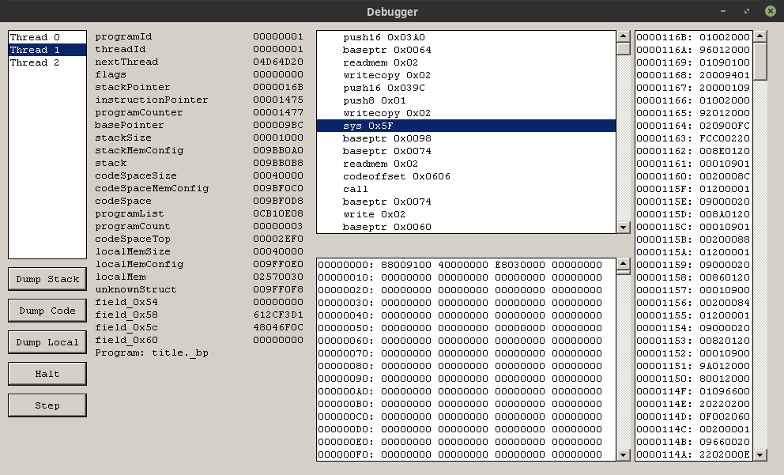

OpenBGI
=======

This project aims to reverse-engineer the Ethornell Buriko General Interpreter (BGI), and create an open source re-implementation of the engine.

We now have a Discord server: https://discord.gg/3zFTJWUNt7

Workflow
--------

Currently, the workflow is to use `Ghidra` for analysing the engine, then reimplement opcodes and support functions on a per-opcode basis.

The strategy is just to implement an opcode, run the game and see if it crashes. It's a pretty crude technique, but it'll work for now.

Milestones reached:
* Reimplemented enough basic opcodes for Tayutama to run.

Architecture
------------

While we're still working on reimplementing opcodes, it doesn't make sense to compile a stand-alone program yet. Therefore our strategy is to hook into an existing engine and redirect functions and opcodes to a shared library instead.

How it works is that we inject a DLL into the game that contains our reimplementation and the debugger. The DLL patches the engine and redirects opcodes to our reimplementations.

Eventually this method will be retired once our code is developed to the point where it can boot a game on its own.

Debugger
--------

To help reverse-engineering the game, we have created a debugging tool for the engine. After patching the game, the debugger is loaded and allows us to inspect threads, halt the execution and single-step through the program.

The debugger window will be the very first window that pops up, and the engine will be started in a *halted* state. Hit the `Run` button to start the game.



Building
--------

Despite building a DLL and hooking into a Windows based game, the toolchain currently only supports Linux.

Before you do anything else, you need to install the various tools and dependencies needed:
```sh
apt install build-essential g++-mingw-w64-i686
```

Building the DLL is as simple as running:
```sh
make
```

Finally, run the game with this helper:
```sh
./run.sh
```

The only supported game right now is `Tayutama Trial`.

Contact
-------

Feel free to join our Discord server: https://discord.gg/3zFTJWUNt7
