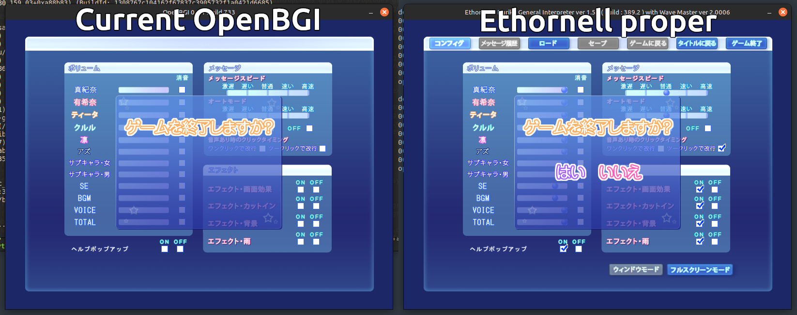

OpenBGI
=======

This project aims to reverse-engineer the Ethornell Buriko General Interpreter (BGI), and create an open source re-implementation of the engine.

We now have a Discord server: https://discord.gg/3zFTJWUNt7

Status
------

While we're still working on reimplementing opcodes, but it now makes sense to compile a stand-alone program.

It's still early days, but we are able to enter the main menu and settings screen of at least one game by executing Buriko Programs (`._bp` scripts.)

We're still exploring graphics routines.



Currently, we're only exploring graphics, not sound.

Workflow
--------

Currently, the workflow is to use `Ghidra` for analysing the engine, and injecting a DLL into the process for live analysis and producing logs.

Using these logs, we implement similar behaviour in OpenBGI.

Milestones reached:
* Reimplemented enough basic opcodes for Tayutama to run.
* Standalone engine is being worked on.


Building
--------

While cross-platform compatibility is our goal, the build chain currenly is only configured for Linux.

Before you do anything else, you need to install the various tools and dependencies needed:
```sh
apt install build-essential gcc-mingw-w64-i686
```

Building the engine is as simple as running:
```sh
make
```

Finally, run the engine in the directory of the game files:
```sh
cd /path/to/the/game
/path/to/openbgi
```

The engine expect *all* game resources to have been extracted from the game using the `unarc` tool in the `tools` directory. In due time we will support loading directly from unmodified game assets, but for now it helps development to have assets extracted.

Ethornell / Buriko General Interpreter
--------------------------------------

"Ethornell / Buriko General Interpreter" is most commonly referred to as "BGI".

BGI consists of a stack-based Virtual Machine (VM) plus subsystems for drawing graphics, synthesising graphical effects, playing sound, and reading/writing files.

The BGI VM consists of two parts:
* Basic opcodes
* Multi-byte extended opcodes

Basic opcodes mainly deal with routine logic, with the multi-byte opcodes deal with system calls, graphics, sound and custom logic.

The BGI engine exclusively executes `Buriko Program`s (Compiled `._bp` files.)

`Scenario scripts` (what defines the actual story, choices, scenes, and text) are compiled scripts. These scripts are in turn interpreted and executed by the BGI VM (VM in a VM kind of situation.)

OpenBGI aims to execute the lower-level VM execution. By doing thing, we get execution of Scenario scripts "for free", as the Scenario interpreter is defined in a Buriko Program.

Contact
-------

Feel free to join our Discord server: https://discord.gg/3zFTJWUNt7
